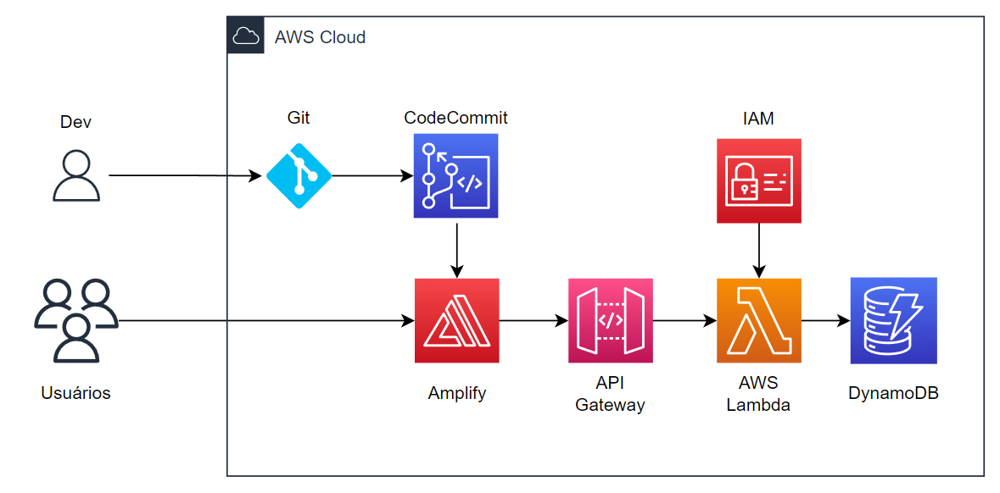

# Criando uma Aplicação Web Serverless com Amplify e Lambda
<h1 id="c273a63e-d57c-43f3-9a36-0d4184ae6c61" class="">Introdução</h1>
Esta documentação descreve as etapas necessárias para a criação de uma aplicação Web, sem a necessidade de gerenciamento de servidores(serverless).

Além de contar com um processo de versionamento para o deploy automático e monitoramento de novas implementações no aplicativo.

A aplicação terá como como principal tarefa, realizar o cálculo de uma operação exponencial passada pelo usuário e retornar o seu resultado final. Sendo este resultado, armazenado em um banco de dados NoSQL.

<h1 id="a64f14b9-34ba-4cfb-9f16-773c8b476507" class="">Explicação das Ferramentas/Serviços</h1><ul id="52a48abc-0392-43c7-ac32-c7b9083b0a0d" class="bulleted-list"><li style="list-style-type:disc">Git – O Git é um Sistema de Controle de Versões Distribuído. Estes sistemas de controle possuem a função de registrar quaisquer alterações feitas em cima de um código, armazenando essas informações e permitindo que, caso seja necessário, um(a) programador(a) possa regredir a versões anteriores de uma aplicação de modo simples e rápido.</li></ul>

<ul id="9ec2874c-b786-4bd3-aa28-47b7d99218b4" class="bulleted-list"><li style="list-style-type:disc">AWS CodeCommit – O AWS CodeCommit é um serviço de controle de código-fonte totalmente gerenciado, seguro e altamente escalável que hospeda repositórios privados do Git.</li></ul>

<ul id="31371b89-d0d5-419a-84e9-556dd5dea9e4" class="bulleted-list"><li style="list-style-type:disc">AWS Amplify – O AWS Amplify é uma solução completa que permite que desenvolvedores frontend para plataformas móveis e Web criem, enviem e hospedem aplicações full-stack na AWS, contando com a flexibilidade de poder aproveitar a amplitude dos serviços da AWS à medida que seus casos de uso evoluem. Não é necessário ter especialização em nuvem.</li></ul>

<ul id="c4ce000a-aff7-4466-a9f6-1a556674f0ed" class="bulleted-list"><li style="list-style-type:disc">API Gateway – O Amazon API Gateway é um serviço gerenciado que permite que desenvolvedores criem, publiquem, mantenham, monitorem e protejam APIs em qualquer escala com facilidade. APIs agem como a “porta de entrada” para aplicativos acessarem dados, lógica de negócios ou funcionalidade de seus serviços de back-end.</li></ul>

<ul id="784a3540-be95-465d-87e5-7b8e30a534f4" class="bulleted-list"><li style="list-style-type:disc">AWS Lambda – O AWS Lambda é um serviço de computação sem servidor e orientado a eventos que permite executar código para praticamente qualquer tipo de aplicação ou serviço de backend sem provisionar ou gerenciar servidores.</li></ul>

<ul id="4d634b0c-7546-4d73-8971-6a947826e469" class="bulleted-list"><li style="list-style-type:disc">IAM – Com o AWS Identity and Access Management (IAM), você pode especificar quem ou o que pode acessar serviços e recursos na AWS, gerenciar permissões refinadas de maneira centralizada e analisar o acesso para refinar as permissões na AWS.</li></ul>

<ul id="92098f8d-8865-4a4f-91f8-40d8e5c67da6" class="bulleted-list"><li style="list-style-type:disc">DynamoDB – O Amazon DynamoDB é um banco de dados de chave-valor NoSQL, sem servidor e totalmente gerenciado, projetado para executar aplicações de alta performance em qualquer escala.</li></ul>

<h1 id="f35caa23-3e56-4b14-8693-0caecc372334" class="">Pré-requisitos do Projeto</h1><ul id="c1808727-a8f4-41c9-9175-5a7f68ec13f8" class="bulleted-list"><li style="list-style-type:disc">Uma conta ativa da AWS</li></ul><ul id="516ef1f9-0249-4302-89ec-75c02e4eba38" class="bulleted-list"><li style="list-style-type:disc">Conhecimento básico dos serviços da AWS</li></ul><ul id="49d033ab-0a90-4da7-9109-ef01077d33fa" class="bulleted-list"><li style="list-style-type:disc">Uma Aplicação Web</li></ul><ul id="ebc1294f-ec66-4d1a-ad73-6dcf16f5c5f5" class="bulleted-list"><li style="list-style-type:disc">Git Instalado</li></ul><ul id="3ca98e46-4047-445b-86ba-f1b982b0d75c" class="bulleted-list"><li style="list-style-type:disc">Visual Studio Code</li></ul>

<h1 id="be6766f2-1ba2-4c7a-9a08-c627cbe79c85" class="">Etapas do Projeto</h1><ol type="1" id="b6dfe190-6a02-47b6-ab26-45e8187f7cd1" class="numbered-list" start="1"><li>Criação do Aplicativo Web</li></ol><ol type="1" id="6463a82d-ea15-4629-a233-f7de1607d0eb" class="numbered-list" start="2"><li>Conexão do Visual Studio Code e Git</li></ol><ol type="1" id="88157f3e-f47a-473f-af80-c8407003e669" class="numbered-list" start="3"><li>Conexão do Git com o AWS CodeCommit</li></ol><ol type="1" id="7bc0767b-4131-416f-b487-03078c4cc49c" class="numbered-list" start="4"><li>Conexão entre CodeCommit e Amplify</li></ol><ol type="1" id="c8208075-0f93-4877-8870-3eccb9311ca6" class="numbered-list" start="5"><li>Criação da função no AWS Lambda</li></ol><ol type="1" id="b21a0e3a-a4ef-45a1-8374-b88b9604873b" class="numbered-list" start="6"><li>Conexão entre o AWS Lambda e o API Gateway</li></ol><ol type="1" id="b6cdd1f1-7ce3-4a66-b047-0471f7927504" class="numbered-list" start="7"><li>Criação de Tabela no DynamoDB</li></ol><ol type="1" id="3d9aed58-69ac-41ef-9c1a-e85a0a16d630" class="numbered-list" start="8"><li>Criação de permissão no IAM para o AWS Lambda conseguir gravar informação no DynamoDB</li></ol><ol type="1" id="7386d295-eb53-44be-aeaa-b73e9aecf3bc" class="numbered-list" start="9"><li>Conexão entre o API Gateway e o Amplify</li></ol><ol type="1" id="df61d82d-b6d3-4ba5-beca-81ae586a6341" class="numbered-list" start="10"><li>Resultados do Projeto</li></ol><h1 id="49741c19-e89c-4726-90ce-14d0c40e883d" class="">Arquitetura</h1><figure id="49acc9b0-706a-4f5b-851b-2d5a6a4abb91" class="image"></figure>

<h1 id="ddc65719-2ab5-4981-b1db-2e31d72dc56b" class="">Passo-a-Passo do Projeto</h1>

<h2 id="74fc4feb-65cd-46b8-8443-a173a5e898f7" class="">1. Criação da Aplicação Web</h2>
O objetivo do projeto não é sobre a complexidade da aplicação ou design dela. Portanto, não iremos nos atentar muito sobre a aplicação em si, mas principalmente na estrutura de soluções em nuvem que utilizaremos para a proposta do projeto.

Logo, utilizaremos, inicialmente, uma estrutura de HTML simples, apenas para colocarmos a aplicação no ar e observarmos se funcionou:
<pre id="b52d16cb-4661-49ef-bc95-d1125f0071c5" class="code"><code>&lt;!DOCTYPE html&gt;
&lt;html lang=&quot;en&quot;&gt;
&lt;head&gt;
    &lt;meta charset=&quot;UTF-8&quot;&gt;
    &lt;meta name=&quot;viewport&quot; content=&quot;width=device-width, initial-scale=1.0&quot;&gt;
    &lt;title&gt;Aplicativo Exponencial!&lt;/title&gt;
&lt;/head&gt;
&lt;body&gt;
    Conheça o potencial do Aplicativo Exponencial!
&lt;/body&gt;
&lt;/html&gt;</code></pre>

Caso você tenha alguma outra estrutura de código que deseja utilize, fique a vontade para usar.

<h2 id="7fb9d852-acdd-4a51-a071-1ee7b0d3f936" class="">2. Conexão do Visual Studio Code e Git</h2>
Já com o Visual Studio Code e Git instalado. Faremos a criação do nosso arquivo “index.html” dentro de uma pasta na sua máquina local:
<figure id="9f52983b-b3e5-40dd-9cbd-dd6d1c57c17b" class="image"></figure>

E então para a utilização do Git no Visual Studio code, recomendo a utilização da extensão:”Git Extension Pack”, para uma visualização mais fácil das atividades do Git:
<figure id="11bc97b8-d3af-43e0-9d1c-d0292ef6f8ce" class="image"></figure>

Se for a primeira utilização do Git em seu VS Code, lembrar de conectar sua conta do GitHub ao VS Code. E então iniciaremos a criação de um repositório local em nosso projeto de aplicativo, com o comando:
<pre id="53ee5588-32d3-4a9d-8609-f15a683752b1" class="code"><code>git init</code></pre>

Ao clicar no menu lateral do VS Code, em “Source Control”, você terá a seguinte visualização:
<figure id="38727694-3bbd-4a33-b29a-9a292d778c7a" class="image"></figure>

<h2 id="37da0810-1115-462f-bcdc-8a6198118fe0" class="">3. Conexão do Git com o AWS CodeCommit</h2>
Antes de conectarmos o nosso repositório local ao repositório do CodeCommit da AWS. Nós iremos precisar realizar a criação de um usuário no IAM, que tenha acesso aos serviços que nós iremos utilizar nesse projeto(caso você esteja utilizando o usuário raiz da AWS).

Por recomendação de segurança, o padrão é que não seja utilizando o usuário raiz(conta que realizou a criação da conta AWS), para atividades padrões da AWS. E que sim, tenha um usuário, criado no IAM, com funções administrativas. Portanto, faremos a criação:
<ol type="1" id="e8623632-2079-4762-9c93-1b54d13eb6da" class="numbered-list" start="1"><li>Acesse o seu AWS Console</li></ol><ol type="1" id="a969d5fe-26df-43ec-83cc-6041d7134943" class="numbered-list" start="2"><li>Acesse o serviço do <strong>Identity and Access Management (IAM)</strong></li></ol><ol type="1" id="8adc8cc2-b68e-4928-ade1-c8b4014b141f" class="numbered-list" start="3"><li>Clique na aba de “Usuários”</li></ol><figure id="040814c2-b718-44e0-b179-736ab67f6de6" class="image"></figure><ol type="1" id="af8fabfa-a03f-4965-9003-ee0f0a15804a" class="numbered-list" start="4"><li>E então clique em “Adicionar usuários”</li></ol><ol type="1" id="5f304603-ddce-4325-83fe-1417a915778f" class="numbered-list" start="5"><li>Dê um nome para o usuário de acesso</li></ol><figure id="2afa8c56-a962-4a4c-b0bf-827a98a2c332" class="image"></figure><ol type="1" id="30c437a6-5bd5-4ba1-9112-e0c75246b79c" class="numbered-list" start="6"><li>Clique em “Anexar políticas diretamente”. E então busque por “admin”, você irá anexar a seguinte política de acesso ao seu usuário:</li></ol><figure id="63f854a3-2ac6-4104-a8ed-7808512751e2" class="image"></figure><ol type="1" id="fb4c1369-187a-4547-a7af-e32776d8b2dd" class="numbered-list" start="7"><li>Na etapa de revisão basta você clicar em “Criar usuário”</li></ol><ol type="1" id="8e849c74-f8f7-4dfe-abf4-1e353a0b09a0" class="numbered-list" start="8"><li>De volta ao painel de usuários, clique no usuário que você acabou de criar</li></ol><ol type="1" id="1c80db3b-4d03-48f6-928a-07e5aea0f782" class="numbered-list" start="9"><li>Clique na aba de “Credenciais de segurança”</li></ol><figure id="726daf4b-329d-481f-b2b6-6b50313a9f4f" class="image"></figure><ol type="1" id="ef2ba473-1b5c-42a1-8810-b2fb6b3a55eb" class="numbered-list" start="10"><li>E então clique em “Habilitar acesso ao console” em “Login do Console”. Para você liberar o acesso aos Console de Acesso da Amazon para esse seu novo usuário:</li></ol><figure id="d4a4d9a2-e871-4c6f-8e0f-5605c03649aa" class="image"></figure><ol type="1" id="23d31909-4f14-49a4-8499-f33ac73e598d" class="numbered-list" start="11"><li>Habilite o console para o usuário</li></ol><ol type="1" id="1ed5781a-075b-48ab-be8e-11c99fe01a90" class="numbered-list" start="12"><li>Crie uma senha personalizada para seu usuário</li></ol><figure id="97a6a6fc-4c68-4a32-bf54-5cb7d1838cc8" class="image"></figure><ol type="1" id="258fafb3-4217-4ff1-be45-cf17469981ba" class="numbered-list" start="13"><li>E então logue nesse novo usuário que você acabou de realizar a criação.</li></ol>

Além de ser um padrão de segurança da AWS, quando nós usarmos o CodeCommit conectado ao nosso Git. Ele nos dá como recomendação não utilizar o usuário raiz, limitando até nossas formas de conexão entre os respositórios, por motivos de segurança.

Então o próximo passo será você acessar o CodeCommit, já utilizando o novo usuário que você criou, e a criação do repositório:
<figure id="6a8b71c0-026e-4661-b04e-602203ef9b8f" class="image"></figure>

Para esse repositório, escolheremos o nome de “aplicativo-exponencial”. E você pode confirmar a sua criação, resultando na seguinte tela:
<figure id="d44b4a23-b2e9-4567-ba06-c5fcefd48222" class="image"></figure>

Para esse projeto, faremos uma conexão utilizando o método HTTPS. Então logo em cima, clique em clonar URL e selecione “Clonar HTTPS”
<figure id="48e5663d-c553-4484-9871-95c7ff98f370" class="image"></figure>

E já com o repositório criado. Faremos a conexão do nosso repositório local com o nosso repositório da AWS. Voltaremos ao Visual Studio Code e usaremos no terminal:
<pre id="f9f2cab4-7c56-4752-9844-8ab936df2a2f" class="code"><code>git remote add aplicativo-exponencial https://git-codecommit.sa-east-1.amazonaws.com/v1/repos/aplicativo-exponencial</code></pre>

Para saber se conectamos corretamente com o repositório remoto da AWS, pode utilizar:
<pre id="4c522f1f-0835-474c-b7b4-311d5bbcda4f" class="code"><code>git remote -v</code></pre>

E aparecerá uma conexão “fetch” e “push” com o seu repositório:
<figure id="7ea353f4-12ff-4432-803c-bdf929f8a606" class="image"></figure>

Por padrão, o git da sua máquina local usará o “branch” principal como “master”, enquanto na AWS o principal “branch” é o “main”. Então faremos uma alteração para evitar possíveis problemas ao enviar os arquivos para a AWS, alteraremos o nome da branch principal do nosso repositório local para “main”:
<pre id="65d2ff2a-6e72-4f3b-8f43-5d419628d2f8" class="code"><code>git branch -m master main</code></pre>

E com todas as configurações realizadas, podemos enviar o nosso arquivo “index.html” que está na nossa máquina local para o repositório da AWS. Faremos primeiro com que nosso arquivo vá para a fase de ‘stage’ e logo em seguida para o ‘commit’:
<pre id="f8417d6d-0982-44d0-857c-952c6e9bb00c" class="code"><code>git add .\index.html</code></pre><pre id="02b683e9-6cac-4e59-8cef-1cbf3b0b0753" class="code"><code>git commit -m &quot;Initial Commit&quot;</code></pre>

E você obterá a seguinte resposta do terminal:
<figure id="1ad24a36-5315-4b74-87f5-0b1650fc081d" class="image"></figure>

Logo em sequência nós faremos o “push” para dentro do repositório da AWS:
<pre id="bef59b90-fb34-47e1-b224-b08167f4e2c9" class="code"><code>git push aplicativo-exponencial main</code></pre>

E teremos a seguinte resposta:
<figure id="35e12174-0b27-4f1b-ad97-e31096aab959" class="image"></figure>

E quando olhamos para dentro do nosso repositório da AWS, teremos já o nosso arquivo “index.html”:
<figure id="7c901517-18bf-4f4b-9c8f-4c1ee5264942" class="image"></figure>

E com o Log de “Commit” atualizados:
<figure id="84e33ccb-21f6-450b-8b11-2ddcc7a85dcc" class="image"></figure>

<h2 id="9b657755-47e8-4714-a8de-421f6526a613" class="">4. Conexão entre CodeCommit e Amplify</h2>
Agora nós faremos a criação do nosso aplicativo no Amplify, utilizando os arquivos presentes no nosso repositório do CodeCommit.
<ol type="1" id="c5741525-95f6-4e7e-9d51-6f679c87611c" class="numbered-list" start="1"><li>Busque pelo serviço “<strong><strong>AWS Amplify</strong></strong>”</li></ol><ol type="1" id="ab1b591b-4eca-40ba-adb8-afa4fd4cf610" class="numbered-list" start="2"><li>Desça até o final da Página e selecione “Amplify Hosting”, clicando em “Comece a”</li></ol><figure id="04524761-5741-4f37-8378-e33d97229021" class="image"></figure><ol type="1" id="7761082b-ccda-4744-a2da-d15a64bd8bfe" class="numbered-list" start="3"><li>Escolha a opção de “AWS CodeCommit”</li></ol><ol type="1" id="3104c13b-ad67-4d28-b780-c5b8f895681c" class="numbered-list" start="4"><li>Faça a seleção do repositório que nós criamos e está conectado com o nosso Git local:</li></ol><figure id="51538263-d184-4126-9167-960129d87f6b" class="image"></figure><ol type="1" id="93148bb7-3a88-4bdf-99b6-fa5fbc893a91" class="numbered-list" start="5"><li>Na etapa de “Configurações de compilação”, apenas altere preenchendo o checkbox de “Permitir que o AWS Amplify implante automaticamente todos os arquivos hospedados no diretório raiz do projeto”</li></ol><figure id="19830d2d-2630-4ba4-b0b4-2a54aea70071" class="image"></figure><ol type="1" id="cfcafc8d-4089-4469-bdd1-002fa5d49d8f" class="numbered-list" start="6"><li>Vá para a página de “Revisar” e clique em “Salvar e Implantar”. Você irá para a seguinte página, onde nós aguardaremos nossa aplicação ficar ativa na web:</li></ol><figure id="59d8a964-aefa-4f39-a6ee-35ba6ff48ea6" class="image"></figure><ol type="1" id="9a77c066-c254-41ce-a25f-b2bc76618010" class="numbered-list" start="7"><li>Assim que a aplicação estiver implantada. Basta você clicar no link da aplicação que você irá conseguir olhar ela com base nosso projeto do “index.html”</li></ol><figure id="8f5140aa-912f-4b8d-8f7c-d965534c421a" class="image"></figure>

Desta forma, sempre que fizermos um “push” dentro do nosso Visual Studio Code. Logo em seguida será refletida no AWS Amplify, em nossa aplicação web.

<h2 id="f902ff70-d42e-428a-9a9d-4e5020adc206" class="">5. Criação da função no AWS Lambda</h2>
Nessa etapa nós iremos criar a nossa função serverless, que será a responsável por executar uma função que fará o cálculo da operação de exponenciação da nossa aplicação e então devolver o resultado.
<ol type="1" id="67c4147e-d236-47ca-848e-29fb63a038f8" class="numbered-list" start="1"><li>Busque pela solução “<strong><strong>AWS Lambda</strong></strong>”</li></ol><ol type="1" id="a1d78a56-d09a-46a2-bb8a-03a8a5a7d814" class="numbered-list" start="2"><li>Selecione a opção de “Criar uma função”</li></ol><figure id="dc6b4486-7b1d-463e-a114-e352cc610b97" class="image"></figure><ol type="1" id="df2561c5-8d85-4653-84fa-e30f7663ccd7" class="numbered-list" start="3"><li>Dê o nome para sua função e escolha Python 3.10. E clique em “Criar Função” ao final.</li></ol><figure id="1a3d0e73-ce8d-46fb-a0fd-05da89222e8d" class="image"></figure><ol type="1" id="b57b10e6-8eae-485d-9515-c3156fa38c63" class="numbered-list" start="4"><li>Logo embaixo, você terá uma função padrão de “Hello World”:</li></ol><figure id="7bdbb3f1-746d-4daa-8fc1-9a3869041db8" class="image"></figure><ol type="1" id="4dbf1a45-fdb5-4e3a-98b2-5cfffdf984be" class="numbered-list" start="5"><li>Nesse espaço de código, você fará a substituição para a seguinte função python:</li></ol><pre id="4e33fefb-8ab3-446e-9dcb-84f10f3496e3" class="code"><code>import json
import math

def lambda_handler(event, context):
    mathResult = math.pow(int(event[&#x27;base&#x27;]), int(event[&#x27;exponent&#x27;]))
    return {
    &#x27;statusCode&#x27;: 200,
    &#x27;body&#x27;: json.dumps(&#x27;Your result is &#x27; + str(mathResult))
    }</code></pre><ol type="1" id="1e8fea97-a29c-4d7d-8ef8-9a2810d20174" class="numbered-list" start="6"><li>Confirme o “Deploy” da sua função:</li></ol><figure id="ab9d786a-5de7-4ed5-923a-31957cfdece1" class="image"></figure><ol type="1" id="46d977ec-29ad-43b1-b0f4-44ab3d3ab17d" class="numbered-list" start="7"><li>Ao lado do Deploy, há um botão para a criação de um teste, para validarmos se a função está realmente funcionando. Clique nele.</li></ol><ol type="1" id="920c1a12-a450-499d-bda7-8c236d005b67" class="numbered-list" start="8"><li>Dentro da nossa função nós usamos duas variáveis: base e exponent. E então no nosso teste, atribuiremos valor para as duas variáveis:</li></ol><figure id="7edd2b58-bdc0-4de3-a18b-0686de91b854" class="image"></figure><ol type="1" id="b7a3897c-02b0-4d74-9217-1a6611650bfe" class="numbered-list" start="9"><li>Salve sua função. E logo em seguida clique no botão de “Test”. Terá o seguinte resultado bem sucedido:</li></ol>
 
<figure id="d93410a7-30c8-44cd-897e-0e266a30cb14" class="image"></figure>

Essa função Lambda não está completa. Voltaremos ao final complementar ela, após fizermos a devida conexão dessa função com a nossa aplicação.

<h2 id="a705c6c4-9d81-4be1-ac4a-cc72ac7aa91a" class="">6. Conexão entre o AWS Lambda e o API Gateway</h2>
Na etapa anterior, fizemos a criação da função que realizará o cálculo da operação matemática de exponenciação, porém, essa função ainda não está conversando com a nossa aplicação no Amplify. E então ai que entra a solução da “API Gateway”. Começaremos a realizar essa conexão entre a AWS Lambda e AWS Amplify.
<ol type="1" id="77388aab-39de-42fe-9ff8-b02358f7f208" class="numbered-list" start="1"><li>Busque pelo serviço de “<strong><strong>Amazon API Gateway</strong></strong>”</li></ol><ol type="1" id="b7b96e11-8484-4dad-a4ef-4c7bed84beef" class="numbered-list" start="2"><li>Desça a página até a opção de “API REST”. Clique em “Compilar”:</li></ol><figure id="adf594a5-19bb-48d7-94a3-8f2b589878e1" class="image"></figure><ol type="1" id="79f51fc7-443d-4230-aac3-88e116a12ab9" class="numbered-list" start="3"><li>Na tela de criação de API, escolha “New API” e dê um nome para a sua API. Confirme a criação da API</li></ol><figure id="48621430-7031-45fe-8d1c-58f37168133c" class="image"></figure><ol type="1" id="454f2225-3128-4395-a448-bf9561fa14bf" class="numbered-list" start="4"><li>Você será redirecionado para a aba de “Resources” da API que você acabou de criar, clique em “/” e logo em seguida clique em “Actions”, selecione a opção “Create Method”:</li></ol><figure id="2ef71bb9-54e9-4710-8315-190b2bd8ff4d" class="image"></figure><ol type="1" id="844332ce-98f8-48d2-bd9e-871ac460996c" class="numbered-list" start="5"><li>Selecione o método POST e confirme:</li></ol><figure id="af94f2e5-52e1-4066-a049-3b8419470874" class="image"></figure><ol type="1" id="faefb22c-9cc5-4b5b-a877-70a4f27805ec" class="numbered-list" start="6"><li>Adicione a sua Função Lambda que acabamos de criar:</li></ol><figure id="460b032b-6d23-4a0d-a06a-123369749f77" class="image"></figure><ol type="1" id="77493c15-37d3-404a-817a-dbda69e70b9d" class="numbered-list" start="7"><li>E então, clique em salvar.</li></ol>

Agora, vamos precisar alterar uma configuração dessa API, para que a conexão entre o AWS Amplify e Lambda funcionem corretamente. Pois a função Lambda será executada em outro domínio, fora do domínio, da aplicação. E então habilitaremos uma configuração para que isso aconteça da forma correta:
<ol type="1" id="52d90ae8-c717-4bc3-bf50-2d3f82aa0c83" class="numbered-list" start="1"><li>Clique novamente em “Actions”</li></ol><ol type="1" id="ec7468ef-15bc-4a88-bea5-36bc63ad8629" class="numbered-list" start="2"><li>Selecione a opção:”Enable CORS”</li></ol><figure id="c9433ef6-499a-41c8-b559-205a0676f03f" class="image"></figure><ol type="1" id="054d921c-f7db-4478-82a4-9783e4385b3d" class="numbered-list" start="3"><li>Confirme a opção de “Enable CORS…”</li></ol><figure id="1e60c1be-74eb-49bc-ba86-008d7f675762" class="image"></figure><ol type="1" id="12efc72a-e785-49d7-b999-fd4586af2e77" class="numbered-list" start="4"><li>Logo em seguida confirme novamente. Você terá a seguinte tela:</li></ol><figure id="4f895d2c-27ac-4b78-a226-b128c8cabc0f" class="image"></figure><ol type="1" id="6a5a0e6a-da75-44a7-b6d8-0b7b68b9ce24" class="numbered-list" start="5"><li>Agora iremos apenas fazer o “Deploy” da nossa API. Clicando novamente em “Actions” e selecionando a opção de “Deploy API”:</li></ol><figure id="a545f73e-21c8-4dbc-bb83-8afb3b76e212" class="image"></figure><ol type="1" id="6bb864af-e0ae-4063-a04b-02537cfb3626" class="numbered-list" start="6"><li>Selecione “New Stage” e então dê um nome para o Stage:</li></ol><figure id="75c0264b-c480-4a07-9a42-85e81295c80c" class="image"></figure><ol type="1" id="f4ad65a5-9f42-4933-9e1b-8d8fc2788e78" class="numbered-list" start="7"><li>Após você finalizar o “Deploy”, seguirá para a próxima tela. Onde você irá precisar salvar a “Invoke URL”, que utilizaremos quando formos chamar nossa API dentro da nossa aplicação:</li></ol><figure id="63826ff4-ba49-4e6a-a819-80976caf1ab6" class="image"></figure><ol type="1" id="b38cd007-3a5c-4a96-bf17-a7272cfc9273" class="numbered-list" start="8"><li>Finalize clicando em “Save Changes” ao final da página.</li></ol>

E agora faremos um teste para validar se a chamada de API está conseguindo acessar a nossa função Lambda corretamente:
<ol type="1" id="9007bf53-c0f1-41c4-ba7c-3a82638dbc34" class="numbered-list" start="1"><li>Vá em “Resources” e clique no método POST:</li></ol><figure id="ec5a79ff-f1a7-47b3-8ffb-614d6f1e275a" class="image"></figure><ol type="1" id="605d699a-0995-46fd-a906-f574fcd072fc" class="numbered-list" start="2"><li>Clique no “Test”</li></ol><figure id="79b91f9a-80d9-44bd-a72a-7fd02af47483" class="image"></figure><ol type="1" id="1776b863-2486-45df-8ae6-48c06b589422" class="numbered-list" start="3"><li>No Body Request, colocaremos aquelas mesmas variáveis de quando fizemos o teste da função Lambda:</li></ol><figure id="43a8102d-44b1-4648-bd08-268d53383754" class="image"></figure><ol type="1" id="2e5be330-2f8c-46c6-a291-f496316cf7b8" class="numbered-list" start="4"><li>Ao final da página, clique em “Test”. Teremos o seguinte resultado:</li></ol><figure id="76e3cfdb-fb3b-4eef-a028-ae6bf98740c7" class="image"></figure>

Desta forma, já estamos com a nossa Função Lambda conseguindo ser evocada pela nossa chamada de API do API Gateway.

<h2 id="22a659ae-0efc-41b7-a2b8-84ad54c57bb7" class="">7. Criação de Tabela no DynamoDB</h2>
Além de retornar o cálculo da exponenciação, nossa aplicação também salvará os resultados em um banco de dados NoSQL. Então faremos a criação dessa tabela no DynamoDB.
<ol type="1" id="74068fe0-dd3f-4678-a61a-81fff07b615d" class="numbered-list" start="1"><li>Busque pelo serviço de “<strong>Amazon DynamoDB</strong>”</li></ol><ol type="1" id="8f83a150-70ac-4efe-8f7f-efd0db24049f" class="numbered-list" start="2"><li>Clique em “Criar tabela”:</li></ol><figure id="1ddc5ffb-f9fb-4a74-ab03-d0bb4c3cc0f5" class="image"></figure><ol type="1" id="964dbbe6-0aa0-4f30-bc0a-b201452dd563" class="numbered-list" start="3"><li>Escolha o nome do seu Banco de Dados e na chave de partição, coloque: ”ID”. O resto deixe padrão e ao final da página confirme com a criação da tabela:</li></ol><figure id="afc778e8-3483-4c6d-bc88-81aa80f9088f" class="image"></figure>

<h2 id="b7752cfc-216b-45d1-aba8-4e44b13b68cf" class="">8. Criação de permissão no IAM para o AWS Lambda conseguir gravar informação no DynamoDB</h2>
Com a tabela NoSQL criada. Nós precisaremos fazer algumas alterações na nossa Lambda Function ,para que ela grave os resultados na tabela. E também precisamos dar a autorização a função(pelo IAM), para que ela consiga adicionar itens na tabela do DynamoDB.
<ol type="1" id="ce0fa098-a370-4903-9f6a-fca7768226df" class="numbered-list" start="1"><li>Busque pelo serviço do “<strong>AWS Lambda</strong>”</li></ol><ol type="1" id="9ad09f34-a63a-4966-b14f-1cbbee38d231" class="numbered-list" start="2"><li>Dentro da aba de “Funções”, clique na função que nós criamos:</li></ol><figure id="dc328456-7f78-459b-896e-ee777c8a61be" class="image"></figure><ol type="1" id="af660537-210d-48a4-8071-04fa3172193a" class="numbered-list" start="3"><li>Primeiro iremos dar a permissão para a nossa função conseguir adicionar itens no nosso banco de dados do DynamoDB. Clique na aba de “configuração”:</li></ol><figure id="26b410b4-d881-4cc1-90c5-2522b88c0e82" class="image"></figure><ol type="1" id="3e1ee910-959c-457e-9bc6-6a4481daf386" class="numbered-list" start="4"><li>Clique no link do “Nome da Função”:</li></ol><figure id="beb285fe-ea10-4c12-897a-f0841ff17041" class="image"></figure><ol type="1" id="7dcf7fb7-0609-4b57-b422-fbb9556ca06a" class="numbered-list" start="5"><li>Irá abrir uma nova guia, dentro do serviço do IAM. Onde você irá clicar em “Adicionar permissões” e selecionar “Criar política em linha”:</li></ol><figure id="9577e2ab-84e8-440f-95ad-e6378c131023" class="image"></figure><ol type="1" id="bfc2611d-ecfa-4258-b449-019e13d69a7a" class="numbered-list" start="6"><li>Você irá clicar na aba de JSON. E abrirá a seguinte tela:</li></ol><figure id="3b15b4ca-0afb-4b31-bb4c-349fcc50dc22" class="image"></figure><ol type="1" id="064c05a1-c436-497c-b50f-a228c5fc70af" class="numbered-list" start="7"><li>Nessa caixa de código, você colocará a seguinte política:</li></ol><pre id="348edc7e-06cd-45d7-954f-bba846f15a36" class="code"><code>{
&quot;Version&quot;: &quot;2012-10-17&quot;,
&quot;Statement&quot;: [
    {
        &quot;Sid&quot;: &quot;VisualEditor0&quot;,
        &quot;Effect&quot;: &quot;Allow&quot;,
        &quot;Action&quot;: [
            &quot;dynamodb:PutItem&quot;,
            &quot;dynamodb:DeleteItem&quot;,
            &quot;dynamodb:GetItem&quot;,
            &quot;dynamodb:Scan&quot;,
            &quot;dynamodb:Query&quot;,
            &quot;dynamodb:UpdateItem&quot;
        ],
        &quot;Resource&quot;: &quot;arn:aws:dynamodb:sa-east-1:302166710586:table/aplicativo-exponencial-db&quot;
    }
    ]
}</code></pre>
OBS: Na parte de “Resource”, você precisa colocar o ARN da tabela do DynamoDB que acabamos de criar. Para você encontrar a ARN da sua tabela, basta você ir no DynamoDB, ir em tabelas e em Visão Geral e terá uma opção de “Informações adicionais”, que ao clicar irá aparecer o ARN da sua tabela.
<ol type="1" id="be563d1d-a2a9-43c9-81ca-0070d79d2c3e" class="numbered-list" start="8"><li>Pode clicar em “Revisar Política”. E logo em seguida dar um nome a essa política para então clicar em “Criar Política”.</li></ol><ol type="1" id="02b21f18-863b-4032-bfee-0dd3d1a7123e" class="numbered-list" start="9"><li>Voltando a nossa função Lambda, nós iremos alterar a função para a seguinte:</li></ol><pre id="6b32db68-2945-45f5-864d-bf8db37ea8d5" class="code"><code>import json
import math
import boto3
from time import gmtime, strftime

dynamodb = boto3.resource(&#x27;dynamodb&#x27;)
table = dynamodb.Table(&#x27;aplicativo-exponencial-db&#x27;)
now = strftime(&quot;%a, %d %b %Y %H:%M:%S +0000&quot;, gmtime())

def lambda_handler(event, context):
    mathResult = math.pow(int(event[&#x27;base&#x27;]), int(event[&#x27;exponent&#x27;]))
    response = table.put_item(
        Item={
            &#x27;ID&#x27;: str(mathResult),
            &#x27;LatestGreetingTime&#x27;:now
            })
    return {
    &#x27;statusCode&#x27;: 200,
    &#x27;body&#x27;: json.dumps(&#x27;Your result is &#x27; + str(mathResult))
    }</code></pre>
NOTA: Na linha de código que aparece:”table = dynamodb.Table(&#x27;aplicativo-exponencial-db&#x27;)”, é necessário alterar o nome da tabela para o nome da tabela que você criou para utilizar no DynamoDB.
<ol type="1" id="db0cc0c1-0149-4ebd-9ec3-9c6dac05ed5d" class="numbered-list" start="10"><li>Realize o Deploy dessa alteração. E realize um novo teste.</li></ol><ol type="1" id="19fc3bf1-1f00-48e7-9366-d1169e677d29" class="numbered-list" start="11"><li>Aparecerá novamente o resultado da teste, igual foi quando estávamos testando a Lambda Function. Mas quando olhamos o DynamoDB, podemos observar que um novo item foi adicionado:</li></ol><figure id="60d47ca9-c97c-45df-90c1-2e87f97a6187" class="image"></figure>
NOTA: Para você conseguir visualizar se adicionou um novo item na sua tabela do DynamoDB. Basta você acessar a tabela do DynamoDB e clicar em “Explorar itens da tabela”.

<h2 id="e4eecb77-be2a-44a1-b78e-011ca50f15e6" class="">9. Conexão entre o API Gateway e o Amplify</h2>
Nesse momento, só precisamos que o nosso aplicativo faça a chamada da API Gateway dentro da sua estrutura de código. Então iremos no Visual Studio Code, e faremos a alteração do nosso código do aplicativo, para a seguinte estrutura:
<pre id="c7506bd6-e417-4bab-9867-92dd842db3b3" class="code"><code>&lt;!DOCTYPE html&gt;
&lt;html&gt;
&lt;head&gt;
    &lt;meta charset=&quot;UTF-8&quot;&gt;
    &lt;meta name=&quot;viewport&quot; content=&quot;width=device-width, initial-scale=1.0&quot;&gt;
    &lt;title&gt;Aplicativo Exponencial!&lt;/title&gt;
    &lt;style&gt;
    h1 {
        color: #FFFFFF;
        font-family: system-ui;
		margin-left: 20px;
        }
	body {
        background-color: #222629;
        }
    label {
        color: #86C232;
        font-family: system-ui;
        font-size: 20px;
        margin-left: 20px;
		margin-top: 20px;
        }
     button {
        background-color: #86C232;
		border-color: #86C232;
		color: #FFFFFF;
        font-family: system-ui;
        font-size: 20px;
		font-weight: bold;
        margin-left: 30px;
		margin-top: 20px;
		width: 140px;
        }
	 input {
        color: #222629;
        font-family: system-ui;
        font-size: 20px;
        margin-left: 10px;
		margin-top: 20px;
		width: 100px;
        }
    &lt;/style&gt;
    &lt;script&gt;
        var callAPI = (base,exponent)=&gt;{
            var myHeaders = new Headers();
            myHeaders.append(&quot;Content-Type&quot;, &quot;application/json&quot;);
            var raw = JSON.stringify({&quot;base&quot;:base,&quot;exponent&quot;:exponent});
            var requestOptions = {
                method: &#x27;POST&#x27;,
                headers: myHeaders,
                body: raw,
                redirect: &#x27;follow&#x27;
            };
            fetch(&quot;https://d1ysnu8xxg.execute-api.sa-east-1.amazonaws.com/dev&quot;, requestOptions)
            .then(response =&gt; response.text())
            .then(result =&gt; alert(JSON.parse(result).body))
            .catch(error =&gt; console.log(&#x27;error&#x27;, error));
        }
    &lt;/script&gt;
&lt;/head&gt;
&lt;body&gt;
    &lt;h1&gt;Conheça o potencial do Aplicativo Exponencial!&lt;/h1&gt;
	&lt;form&gt;
        &lt;label&gt;Número Base:&lt;/label&gt;
        &lt;input type=&quot;text&quot; id=&quot;base&quot;&gt;
        &lt;label&gt;...elevado a:&lt;/label&gt;
        &lt;input type=&quot;text&quot; id=&quot;exponent&quot;&gt;
        &lt;button type=&quot;button&quot; onclick=&quot;callAPI(document.getElementById(&#x27;base&#x27;).value,document.getElementById(&#x27;exponent&#x27;).value)&quot;&gt;CALCULAR&lt;/button&gt;
    &lt;/form&gt;
&lt;/body&gt;
&lt;/html&gt;</code></pre>

Sendo que na parte do “fetch” no script. Você precisa substituir a “Invoke URL” que conseguimos na etapa em que estávamos montando nossa API na API Gateway.

<h2 id="5497f1b6-8250-4940-86de-116a31ddacc5" class="">10. Resultados do Projeto</h2>
Logo em seguida realize o “push” para o nosso repositório no AWS CodeCommit. Por meio das funções, no terminal do VS Code:
<pre id="e1226d17-2792-45ed-942a-54d2f062f0cb" class="code"><code>git add .\index.html</code></pre><pre id="b241d081-8e88-43fe-991d-8f3db0fd19d9" class="code"><code>git commit -m &quot;Aplicação Completa&quot;</code></pre><pre id="62e6060a-c000-401b-a289-128053c270af" class="code"><code>git push aplicativo-exponencial main</code></pre>

Logo após isso, o novo código da aplicação será enviado para o nosso repositório da AWS. E fará com que o AWS Amplify atualize com a nova versão da aplicação. E ficará com o seguinte visualização:
<figure id="92a7d776-1c39-44e1-b837-37ab7e3a78c4" class="image"></figure>

Ao preencher os parâmetros e solicitar o resultado:
<figure id="b1a44d45-b509-425b-9dea-1ae9c99df850" class="image"></figure>

E por fim, nossos dados sendo armazenados no nosso banco de dados NoSQL:
<figure id="1178c5b4-3a00-45c3-983f-f626b0307cb8" class="image"></figure>

Se você estiver utilizando esse documentação a fim de estudos. Recomendo, ao final do projeto fazer a exclusão de:
<ul id="31287958-08be-4909-bb7a-4dea723ad7e6" class="bulleted-list"><li style="list-style-type:disc">Repositório no CodeCommit</li></ul><ul id="31a04845-0c54-42d2-bb6e-4940f6267211" class="bulleted-list"><li style="list-style-type:disc">Exclusão do Aplicativo no Amplify</li></ul><ul id="adc5d73a-386b-44c8-a38d-e0072fa198ca" class="bulleted-list"><li style="list-style-type:disc">Exclusão da API no API Gateway</li></ul><ul id="180a3de9-afb4-492b-bf21-7a692ba6285f" class="bulleted-list"><li style="list-style-type:disc">Exclusão da Função no AWS Lambda</li></ul><ul id="379ffb42-f884-463b-bb51-52d9fcccb91a" class="bulleted-list"><li style="list-style-type:disc">Exclusão da tabela no DynamoDB</li></ul>
</article></body>
